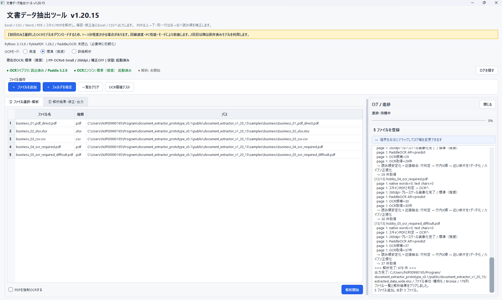
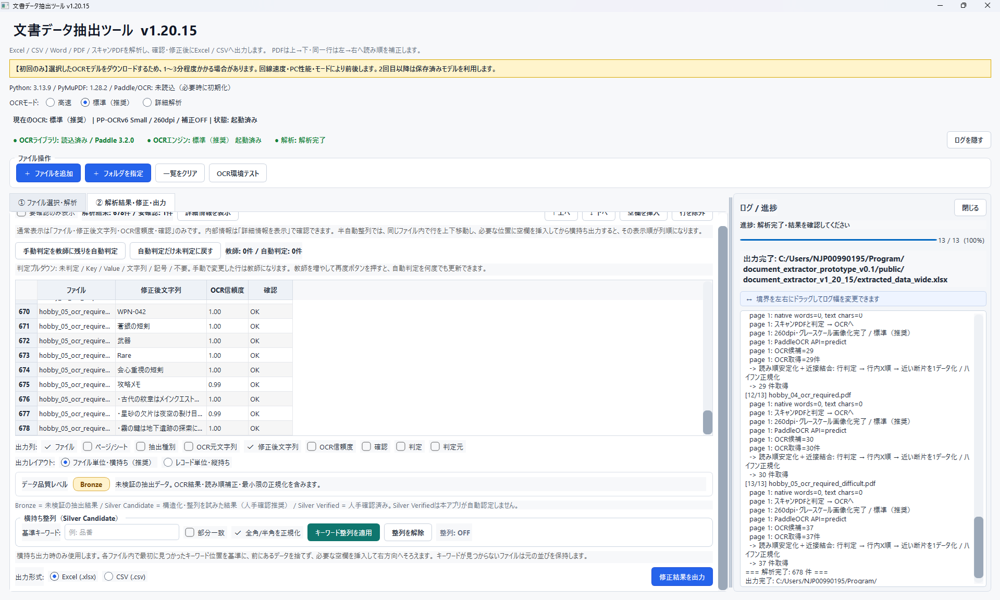

# Document Data Extractor

既存文書から業務システム用のマスターデータを作成するための、ローカル動作型データ抽出・前処理ツールです。

Excel / CSV / Word / PDF / スキャンPDFから文字列や表データを抽出し、確認・修正・簡易分類・整列を行ったうえで、Excel / CSVへ出力できます。

> 現在のバージョン: **v1.20.15**

## Screenshots

### メイン画面



### OCR解析結果



## 開発目的

企業内には、Excel・CSV・Word・PDF・スキャンPDFなどの形式で情報が分散しており、業務システムやデータベースへ移行するには、人手による転記・整理・確認が必要になることがあります。

Document Data Extractor は、こうした既存文書からデータを取り出し、**業務システムで利用するマスターデータを作成するための前処理基盤**として開発しています。

単純なOCRや文字抽出だけを目的とするのではなく、

1. 文書からデータを抽出する
2. 読み順や文字列を確認・修正する
3. 必要に応じて分類・整列する
4. 後続システムへ渡しやすいExcel / CSVとして出力する

という流れを支援します。

将来的な活用例として、規格・仕様書・要件書などから整理したデータをマスターデータとして利用し、**製品仕様や設計条件との照合・要件判定を支援するアプリケーション**への展開も検討しています。

## 主な機能

- Excel (`.xlsx`, `.xlsm`) のセルデータ抽出
- CSV (`.csv`) のセルデータ抽出
- Word (`.docx`) の文章・表データ抽出
- PDFのテキスト直接抽出
- スキャンPDF / 画像化PDFのOCR
- PDFの読み順補正
  - 上 → 下
  - 同一行は左 → 右
- OCR断片の結合・表記補正
- OCR信頼度の表示
- 抽出結果の手動修正
- 行の移動・除外・空欄挿入
- Key / Value / 文字列 / 記号 / 不要 の手動分類
- 手動分類を教師データとして利用する簡易自動分類
- キーワードを基準にした横持ち整列
- Excel / CSV出力
- 横持ち / 縦持ち出力
- データ品質レベルの表示
- OCR処理・進捗ログ表示

## 対応形式

| 種類 | 形式 | 主な処理 |
|---|---|---|
| Excel | `.xlsx`, `.xlsm` | セルを直接抽出 |
| CSV | `.csv` | セルを直接抽出 |
| Word | `.docx` | 本文・表を直接抽出 |
| PDF | `.pdf` | テキスト直接抽出 |
| スキャンPDF | `.pdf` | PaddleOCRによるOCR |

CSVは `UTF-8-SIG`、`UTF-8`、`CP932` を順に試行します。

## OCRモード

| モード | 概要 |
|---|---|
| 高速 | PP-OCRv5 Mobile / 220 dpi / 補正OFF |
| 標準（推奨） | PP-OCRv6 Small / 260 dpi / 補正OFF |
| 詳細解析 | PP-OCRv6 Medium / 300 dpi / 向き・歪み・文字行補正ON |

OCRモデルは初回利用時に取得される場合があります。2回目以降は保存済みモデルを利用します。

## データ品質レベル

本ツールでは、抽出結果の状態を分かりやすくするため、以下の品質レベルを使用します。

### Bronze

未検証の抽出データです。

OCR結果、読み順補正、最小限の正規化を含みますが、内容の正しさは保証しません。

### Silver Candidate

キーワード整列など、構造化・整形処理を適用した候補データです。

業務利用前に人手確認を推奨します。

### Silver Verified

人が確認したデータを意味します。

**本アプリは Silver Verified を自動認定しません。**

この考え方はメダリオンアーキテクチャの考え方を参考にしていますが、本ツール独自の運用ラベルです。

## 想定用途

- 紙・PDF帳票のデータ化
- 古いExcel / Word資料からの情報抽出
- 社内文書検索用データの作成
- データベース移行前の整理
- マスターデータ作成の前処理
- 規格書・仕様書・要件書からの項目抽出
- 検査基準・設計条件の整理
- 後続の検索・照合・判定アプリ用データの作成

### 要件判定システムへの応用例

```text
規格書 / 仕様書 / 要件書
        ↓
Document Data Extractor
        ↓
Bronze
        ↓
分類・整列・人手確認
        ↓
Verified master data
        ↓
要件判定 / 照合アプリ
```

規格や要件には例外条件、参照関係、複合条件などが含まれるため、抽出結果を無確認のまま自動判定用マスターへ投入する用途は想定していません。

## インストール

### 推奨環境

- Windows 11
- Python 3.10 ～ 3.13
- 64 bit Python

仮想環境の利用を推奨します。

```powershell
python -m venv .venv
.\.venv\Scripts\Activate.ps1
python -m pip install --upgrade pip
python -m pip install -r requirements.txt
```

ソースから起動する場合:

```powershell
python main.py
```

## OCR設定ファイル

PaddleOCR / PaddleXのOCRパイプライン設定として `OCR.yaml` を使用します。

`main.py` と同じディレクトリへ配置してください。

```text
document-data-extractor/
├─ main.py
├─ OCR.yaml
├─ DocumentDataExtractor.spec
├─ README.md
├─ LICENSE
├─ requirements.txt
├─ pyproject.toml
└─ CHANGELOG.md
```

## exeビルド

PyInstallerをインストールします。

```powershell
python -m pip install ".[build]"
```

その後、付属のspecファイルを使用します。

```powershell
python -m PyInstaller --noconfirm --clean DocumentDataExtractor.spec
```

生成物:

```text
dist/
└─ DocumentDataExtractor/
   ├─ DocumentDataExtractor.exe
   └─ _internal/
```

本プロジェクトでは `onedir` 形式を基本とします。`DocumentDataExtractor.exe` だけを取り出さず、`DocumentDataExtractor` フォルダ全体を配布してください。

### PaddleX / PyInstallerについて

PaddleXはOCRパイプライン作成時にインストール済み依存パッケージのmetadataを参照します。

そのため `DocumentDataExtractor.spec` は、PaddleXが必要とする依存パッケージのmetadataをビルド時に収集します。これを省略すると、exe版だけで次のようなエラーになることがあります。

```text
DependencyError: `OCR` requires additional dependencies.
```

また、Paddleを `--collect-all paddle` で丸ごと収集すると、不要なC++ヘッダ等まで取り込まれ、Windowsで非常に深いパスが生成されることがあります。本specではPaddleの実行バイナリを中心に収集します。

## 公開・配布前の確認

- Python版で通常抽出ができる
- Python版でOCR環境テストが通る
- exeが起動する
- exe版でもOCR環境テストが通る
- OCR必須サンプルPDFを抽出できる
- Excel / CSV出力ができる
- 別PCでも起動・抽出できる
- `DocumentDataExtractor` フォルダ全体で配布する
- README / LICENSE / THIRD-PARTYライセンス条件を確認する

## 制限事項

- OCR結果は100%の正確性を保証しません。
- 自由記述の手書き文字は認識精度が大きく低下する場合があります。
- 複雑な表、段組み、特殊なレイアウトでは読み順やセル構造を完全に復元できない場合があります。
- 規格・法令・安全要件など重要な判断に使用する場合は、必ず原文と照合してください。
- Silver Candidateは人手確認前の候補データです。
- 本ツール単体では業務上の適合・不適合を判定しません。

## プライバシー

通常の文書解析処理はローカルPC上で行います。

ただし、PaddleOCRモデルが未取得の場合、初回利用時にモデルファイルを取得するためネットワーク通信が発生する場合があります。

機密文書を扱う場合は、使用環境・モデル取得済み状態・組織の情報セキュリティポリシーを確認してください。

## ライセンス

本プロジェクトは **GNU Affero General Public License v3.0 or later (AGPL-3.0-or-later)** で公開します。

詳細は `LICENSE` を参照してください。

本プロジェクトは複数のサードパーティライブラリを利用しています。各ライブラリにはそれぞれのライセンス条件が適用されます。

特にPyMuPDFはAGPL / 商用ライセンスのデュアルライセンスで提供されているため、配布形態を変更する場合はライセンス条件を再確認してください。

## 注意

本ソフトウェアによる抽出結果、OCR結果、分類結果、整列結果を利用して生じた損害について、作者は保証しません。

重要データは原本を保持し、抽出結果を確認してから利用してください。
